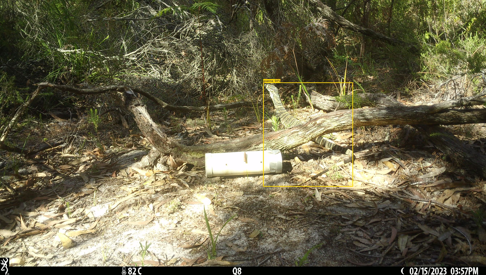

# UNSW goanna detector

## Overview

The code in this repo trains, runs, and evaluates models to detect wildlife in camera trap images from Australia, particularly  [goannas](https://en.wikipedia.org/wiki/Goanna) in Australia.  This project is trained on data provided by the University of New South Wales.  The purpose of this project wasn't exactly to find goannas, although that's a nice side effect; rather, it was to build up a training dataset for a similar-looking invasive reptile in Florida (the [Argentine black and white tegu](https://en.wikipedia.org/wiki/Argentine_black_and_white_tegu)), for which we have relative few training images.

## Important steps/files

These are listed in roughly the order in which you would use them.

### Map annotations to images, convert to COCO Camera Traps format

This happens in [unsw-goannas-data-import.py](unsw-goannas-data-import.py).

* Match labels in Timelapse-exported .csv's to images on disk

* Convert to a COCO camera traps .csv file

The output at the end of this step will be a COCO Camera Traps file pointing to the original data, containing only non-empty images (not all images were reviewed, so we don't have a reliable way of identifying empty images).

### Turn species-level labels into bounding boxes

* Run [MegaDetector](https://github.com/agentmorris/MegaDetector/) on the data, using test-time augmentation and aggressive repeat detection elimination.  Details of that process are outside the scope of this README.

* Resize images to 1600px on a side so they would load faster during review, and copy them to a new directory, with one folder per species.  Within each folder, filenames preserve the original relative paths, with '/' replaced by '#'; for example:  `brown_snake/BrendanAltingMLDP2023Images#Q34#Q34__2022-12-22__14-56-38(1).JPG`  This happens in [unsw-goannas-labeling.py](unsw-goannas-labeling.py). 

* Convert MegaDetector results to the format used by [labelme](https://github.com/wkentaro/labelme/), using a slightly 
different threshold for each class (e.g. 0.2 for dingos, where we know MD works quite well, but something like 0.08 for snapes).  This also happens in [unsw-goannas-labeling.py](unsw-goannas-labeling.py). 

* Review images in labelme (I'm specifically using [this fork of labelme](https://github.com/agentmorris/labelme)), fixing up any boxes that are broken/missing/etc.  Along the way, delete images where it's not possible to assign boxes (typically images where the animal isn't visible), and images with multiple species present (very rare).

For all clases other than goannas, MD worked well enough (or the total number of images was small enough) that no additional training was required.  For goannas, every 5,000 images, train a single-class goanna detector.  The first detector used MegaDetector as a starting point; after ~15,000 images, I switched to training from scratch and using YOLOv8 rather than YOLOv5, so training could easily finish overnight.  Basically I plowed through 5,000 imges at a time, then let YOLO think about things for a while.  The first 5,000 images were brutal and I was *almost* drawing bounding boxes from scratch (maybe 2 seconds per image), the last 5,000 images were more or less like reviewing dingos where I was just banging the page-down key as fast as I could (5-10 images per second).

Re-training of iterative goanna-specific detectors happened in [unsw-goannas-train-intermediate-model.py](unsw-goannas-train-intermediate-model.py).

The output at the end of this step was labelme-formatted .json files associated with each image, e.g., for the sample image referred to above:

`brown_snake/BrendanAltingMLDP2023Images#Q34#Q34__2022-12-22__14-56-38(1).json`

### Convert to COCO format, and preview the COCO dataset to make sure everything still looks sensible

This happened via [unsw-goannas-labelme-to-coco.py](unsw-goannas-labelme-to-coco.py).  Location (i.e., camera ID) information is also added at this stage.

The output at the end of this step is a COCO file, pointing to the labeling folder (i.e., the folders that use species names, not the original data), including location IDs.

### Convert to YOLO format, discarding a few classes

This happens in [unsw-goannas-prepare-yolo-training-set.py](unsw-goannas-prepare-yolo-training-set.py).  Specifically, this script:

* Splits the COCO-formatted data into train/val sets
* Previews the train/val sets to make sure everything looks sensible
* Converts to YOLO training format (YOLO-formatted annotations and a YOLOv5 dataset.yaml file)

All the images in the YOLO training folders are symlinks back to the labelme folders.

### Train

Two models were trained using this repository, one using YOLOv5 (with MDv5 as a starting point) and one using YOLOv5.

Training happens at the CLI, but [unsw-goannas-training.py](unsw-goannas-training.py) tracks all the commands used to train and to monitor training progress.

### Postprocess and review results

[unsw-goannas-review-results.py](unsw-goannas-review-results.py) is a notebook that:

* Runs a trained model on the validation data
* Renders detections onto thumbnail images
* Generates confusion matrices and HTML preview pages to present the results

### Other files in this repo

* [unsw-goannas-scrap.py](unsw-goannas-scrap.py): Exploratory analyses performed around the time of the original model training (2023).
* [unsw-goannas-explore-data.py](unsw-goannas-explore-data.py): Exploratory analyses performed when I was rehydrating this project in 2025.
* [unsw-alting-compare-goanna-detections.py](unsw-alting-compare-goanna-detections.py): Compare the two goanna detectors (YOLOv5 and YOLOv8), and compare both to the ground truth labels, and run on the complete dataset (including unlabeled images) to find previously-missed goannas.
